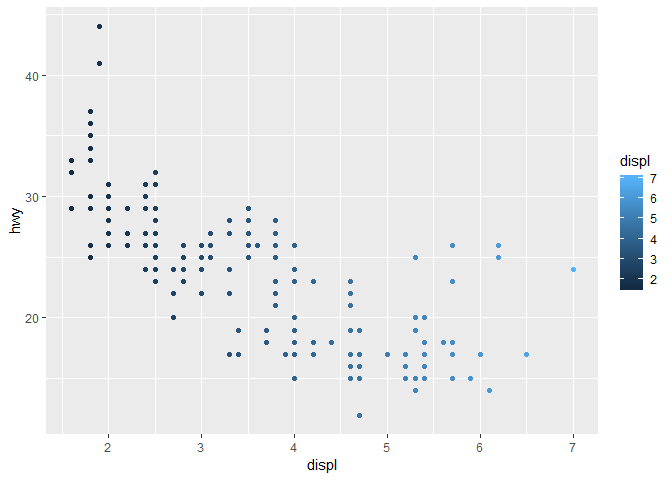
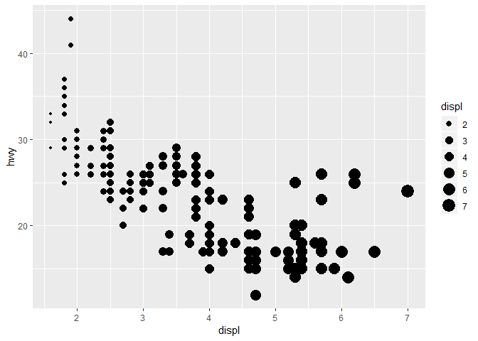
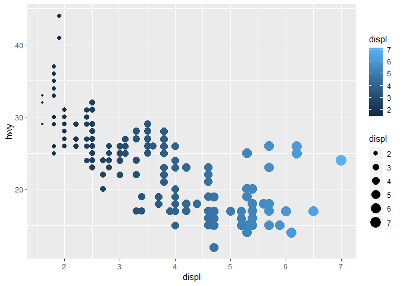
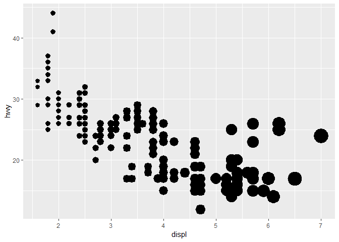
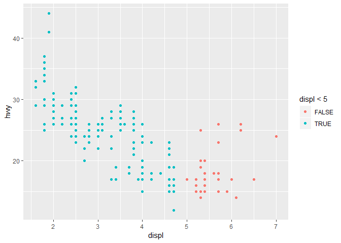

Homework 1: ggplot2
================
Liisi Karlep
2019-07-04

``` r
library(ggplot2)
```

By using *mpg* dataset:

``` r
mpg
```

    ## # A tibble: 234 x 11
    ##    manufacturer model displ  year   cyl trans drv     cty   hwy fl    class
    ##    <chr>        <chr> <dbl> <int> <int> <chr> <chr> <int> <int> <chr> <chr>
    ##  1 audi         a4      1.8  1999     4 auto~ f        18    29 p     comp~
    ##  2 audi         a4      1.8  1999     4 manu~ f        21    29 p     comp~
    ##  3 audi         a4      2    2008     4 manu~ f        20    31 p     comp~
    ##  4 audi         a4      2    2008     4 auto~ f        21    30 p     comp~
    ##  5 audi         a4      2.8  1999     6 auto~ f        16    26 p     comp~
    ##  6 audi         a4      2.8  1999     6 manu~ f        18    26 p     comp~
    ##  7 audi         a4      3.1  2008     6 auto~ f        18    27 p     comp~
    ##  8 audi         a4 q~   1.8  1999     4 manu~ 4        18    26 p     comp~
    ##  9 audi         a4 q~   1.8  1999     4 auto~ 4        16    25 p     comp~
    ## 10 audi         a4 q~   2    2008     4 manu~ 4        20    28 p     comp~
    ## # ... with 224 more rows

1.  Map a continuous variable to color, size, and shape. How do these aesthetics behave differently for categorical vs. continuous variables?

-   Color

``` r
ggplot(data = mpg) + 
  geom_point(mapping = aes(x = displ, y = hwy, color = displ))
```



-   Size

``` r
ggplot(data = mpg) + 
  geom_point(mapping = aes(x = displ, y = hwy, size = displ))
```



-   Shape \#`{r} #ggplot(data = mpg) +  #  geom_point(mapping = aes(x = displ, y = hwy, shape = displ)) #`

This will produce an error: A continuous variable can not be mapped to shape

A continuous variable can not be mapped to shape, can be mapped to color and size. Categorical variables can be mapped to all of those, but it does not make sense to use size to map them. For continuous variables the color and size change gradually according to the values, for categorical variables certain fixed color or size is given for each value.

1.  What happens if you map the same variable to multiple aesthetics?

``` r
ggplot(data = mpg) + 
  geom_point(mapping = aes(x = displ, y = hwy, size = displ, color = displ))
```



They are both displayed on the same graph.

1.  What does the stroke aesthetic do? What shapes does it work with? (Hint: use ?geom\_point)

``` r
ggplot(data = mpg) + 
  geom_point(mapping = aes(x = displ, y = hwy, stroke = displ))
```



The stroke aesthetic is used to modify the width of the border of the shape and it can be used for shapes that have a border (like 21), so that you can colour the inside and outside separately.

1.  What happens if you map an aesthetic to something other than a variable name, like aes(colour = displ &lt; 5)?

``` r
ggplot(data = mpg) + 
  geom_point(mapping = aes(x = displ, y = hwy, color = displ < 5))
```



It will color the points according to whether the statement is false or true for them.
